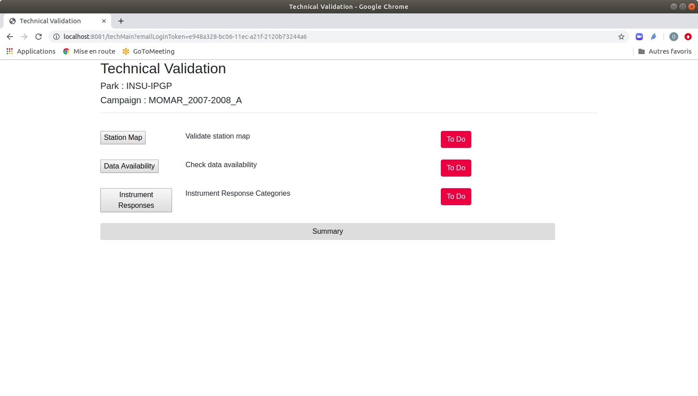
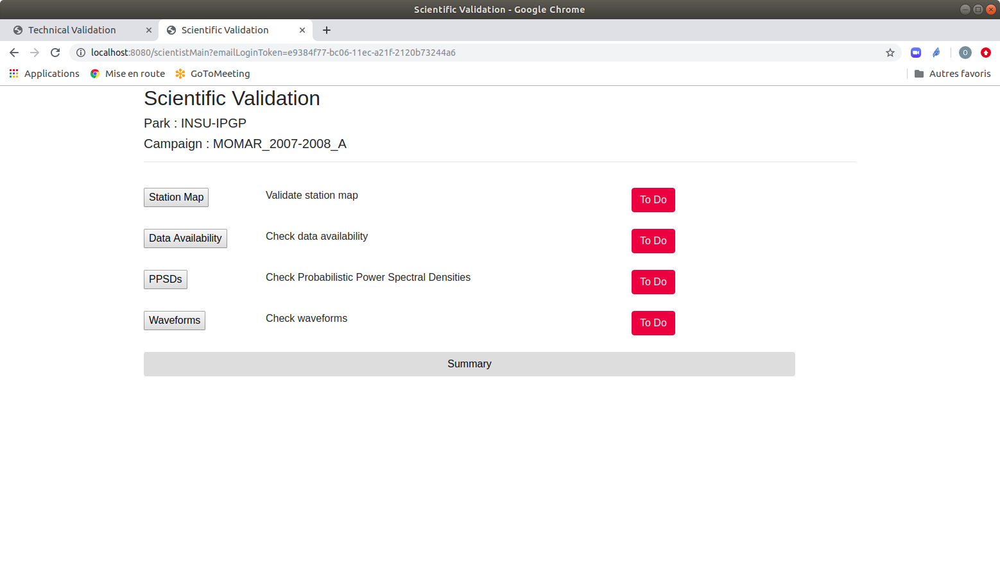

Data and metadata validation
============================

Data and metadata will be validated via a web application showing all plots created by visualQC commands.

Web applications
----------------

There are 2 different web applications, one for a technical validation and the other for a scientific validation.

Technical Validation
^^^^^^^^^^^^^^^^^^^^

The figure :ref:`mainSci` is the main page of technical validation, shown when a technical auditor start to connect to the validation application.

.. _mainSci:

   Main page of technical validation

Scientific Validation
^^^^^^^^^^^^^^^^^^^^^

   Main page of scientific validation

Access to the validation website
--------------------------------

The validation website is not designed to be publicly available. An auditor will receive an email containing a link to the validation web site. For the security reason, this link contains a token that will be checked by the site, if the token is valid. The validity duration can be set by the web site administrator according to the needs of the auditor in charge of validation. Each time this auditor connects to the web validation site, the token will be checked if it is still valid.

Web validation processes
------------------------

